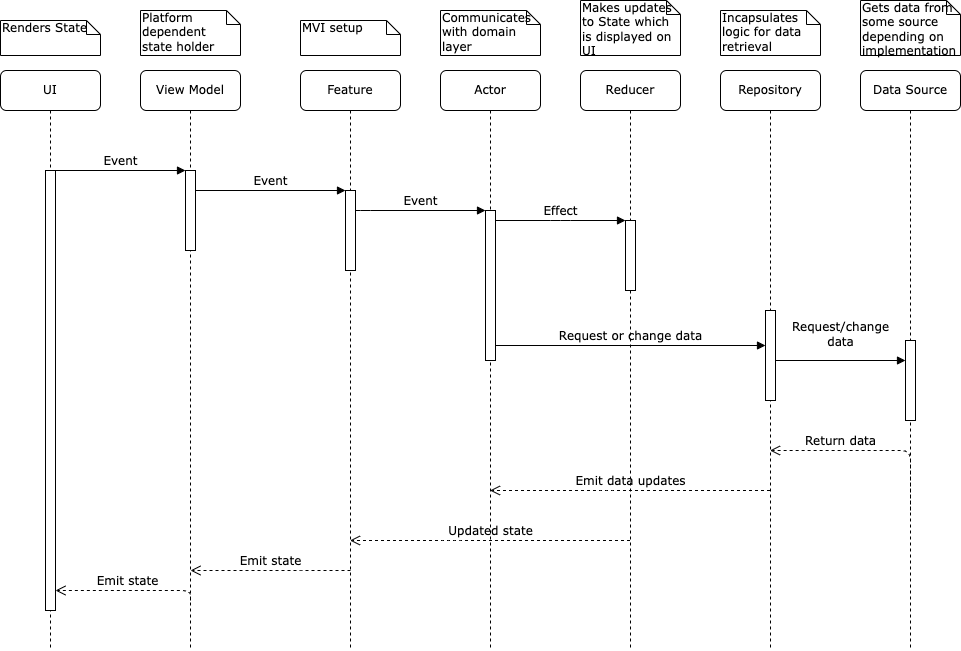

# Catawiki Android Assignment
​
Welcome to the Android developer candidate assignment.
​
The big part of the items we offer at auctions is collectables. One of the most famous collectables are… **Pokémons**! Let’s catch’em all!
​
In this task, it comes to presenting your skills, so try to focus on quality rather than quantity of code. We don’t require you to reinvent the wheel, so you can use any library you find suitable. When working on a project use version control system (we would like to see the history of commits).
​
## Description
Create an app to look up the direct evolution chain of a Pokémon species.
The app should show a list of Pokémon species.
When the user selects a Pokémon from the list, the user navigates to a Pokémon detail screen.
​
Use the public *Poké-API*: https://pokeapi.co
​
## Requirements
1. List of (paginated) Pokémon species (`v2/pokemon-species`)
   * Name
   * Image (To get the image use https://raw.githubusercontent.com/PokeAPI/sprites/master/sprites/pokemon/{species_id}.png)
​
2. Details screen of species, containing:
   * Name
   * *flavor_text* (description)
   * Name & image of the first evolution species the current Pokémon evolves to. 
      * You can get the Evolution chain from here (`/v2/evolution-chain/{chain_id}`) 
   * The *capture_rate* difference between the current species and the species it evolves to. 
     * If capture_rate difference is negative we would like to highlight that in red, and in green if it is positive.
     * *capture_rate* is available in https://pokeapi.co/api/v2/pokemon-species/{pokemon-id}
   
​
## Assumptions
* Species evolves into only 1 other species
* Use english locale for text
​
## What will be assessed?
1. Functionality: the application has the functions described in the job, does not crash *(weight 2)*
2. Quality of code: the code does not contain any design faults, is written in accordance with the conventions and standards, and is easy to read with a clear and progressive commit history*(weight 3)*
3. User Experience & UI Design: application is clear and easy to use (but no need to create some super-beautiful graphics, it’s more about the layout and chosen components) *(weight 1.5)*
4. Application Architecture: The application can be easily maintained and extended, there are clear layers visible, etc. *(weight 3)*
5. Testabilty: The code should be unit-tested.*(weight 1.5)*
​
## Bonus points
Try to approach like to a production application like support typical situations unique to mobile applications, such as lack of network coverage, etc. If you want, you can spend some more time to create the attractive UI, animations or to add new functionality.
​
We encourage the candidate to use RxJava although it is not mandatory.

Dear reviewer! Here are some notes about the implementation details of this project:

1. Application uses local database as single source of truth for app data. It provides observable source so whenever there are any changes to the locally stored data - every subscriber will be notified.
2. Application supports following configuration changes: screen rotation, dark mode.
3. Application draws it's content behind system bars and handles window insets.
4. For presentation layer MVI architecture with some adjustments is used in order to achieve loose coupling. Main component that connects logic altogether is Feature, it is completely decoupled from any android related dependencies(could be reused in multiplatform setup for presentation layer of the app). Another vital components are:
- Actor(performs logic required to manipulate domain data for the screen)
- Reducer(maps domain data to screen state).
5. UI is implemented via Jetpack Compose(special compose related are optimizations included: kotlin [immutable collections](https://github.com/Kotlin/kotlinx.collections.immutable), R8 minification support).
6. One time events are handled as part of the State updates as recommended by [Google](https://developer.android.com/topic/architecture/ui-layer/events#handle-viewmodel-events) for Compose architecture.
7. Gradle setup is done via separate scripts for different types of modules/functionality

All components communicate via proxy classes that carry the data related to what logic should be invoked or what data should be updated. These are:
- Event(comes from UI layer as an action to users interaction with it)
- Effect(each Event triggers some logic which results in Effects that carry the data necessary to update the State)
- State(model that represents UI state of the screen)

Such architecture is easily scalable since another handlers for screen contract's related classes could be added without adding changes to existing ones. All components aren't aware of each other and it's easy to unit test them.

App architecture could be described by following scheme(without some intermediate abstractions as use cases):

